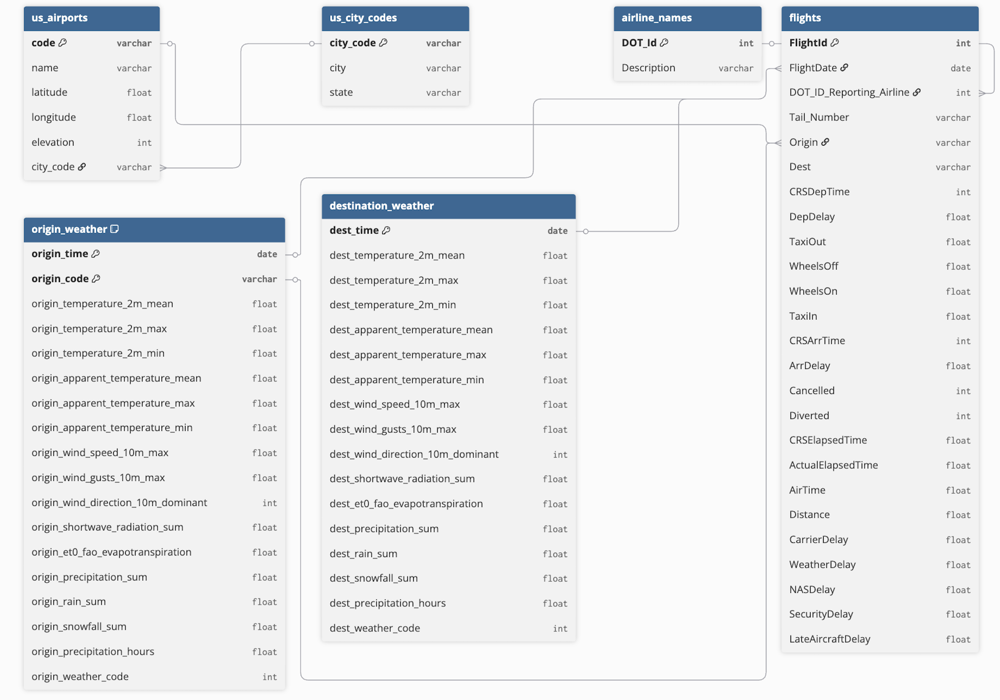

# Flight Delay Risk Scoring for Incoming Flights to PHL

Predicting whether inbound flights to Philadelphia International Airport (PHL) will arrive **more than 15 minutes late** using historical BTS flight records, airport metadata, and origin/destination weather features.

## Why this project matters

Flight delays are expensive and operationally disruptive. This project explores whether historical flight and weather data can be used to identify incoming flights at elevated risk of delay, with the goal of supporting **airport operations prioritization** rather than fully automated decision-making. 

## Problem statement

Given information known before arrival, estimate the probability that an incoming flight to PHL will be meaningfully delayed.

**Target definition**

* `IsDelayed = 1` if arrival delay > 15 minutes
* `IsDelayed = 0` otherwise

This is an imbalanced classification problem:

* **80.8%** of flights arrived within 15 minutes
* **19.2%** arrived more than 15 minutes late 

Because of that class imbalance, this project emphasizes **recall, precision, F1, ranking quality, and threshold analysis** rather than headline accuracy alone.

## Key findings

### 1. Accuracy is a weak metric here

Because only about 19% of flights are delayed, a naive model can look “accurate” by predicting mostly on-time flights. The class imbalance makes recall, precision, F1, and ranking metrics much more informative than raw accuracy. 

### 2. Daily weather data was less useful than expected

Our analysis found that daily weather features were not strong enough on their own to drive highly effective delay prediction. The notebook’s conclusion explicitly notes that **daily aggregated weather may not be granular enough** for this task. 

### 3. Origin conditions appeared more informative than destination conditions

In simple correlation analysis, origin-airport weather features showed somewhat stronger relationships with delay than destination features, though those relationships were still modest. 

### 4. PCA did not materially improve the weather-based signal

A PCA experiment on weather variables did not meaningfully improve recall for the weighted logistic regression pipeline, suggesting that the limiting factor was likely the underlying signal in the data rather than just multicollinearity in weather features.

### 5. The project is more convincing as decision support than automation

The class notebook concluded that the final models were **not strong enough for real deployment at PHL** and that richer, more granular data would likely be required. That is a useful practical takeaway: this project is best understood as a risk-scoring / prioritization exercise, not a production-ready airport automation system. 

## Main takeaway

This project demonstrates a realistic machine learning workflow on a difficult operational problem:

* assembling multi-source transportation data
* engineering usable features from flight and weather records
* evaluating under class imbalance
* interpreting model limitations honestly
* reframing outputs as **risk ranking** rather than overclaiming binary certainty

The strongest lesson was not that “weather predicts delays well,” but that **data granularity matters**. Daily airport-level weather was too coarse to fully capture the operational conditions driving delay outcomes. Personally, the reframing of the problem away from pure predictive accuracy to risk-ranking to provide support to current operations was a great teaching moment about how ML can **actually** fit into modern workflows/processes.

## Data

This project combines multiple sources:

* [**BTS flight records**](https://www.transtats.bts.gov/tables.asp?QO_VQ=EFD&QO_anzr=Nv4yv0r) for U.S. flights inbound to PHL
* [**Open-Meteo daily weather**](https://open-meteo.com/en/docs/historical-weather-api) for both origin and destination airports
* [**Supporting airport / airline lookup data**](https://github.com/ip2location/ip2location-iata-icao) for enrichment and visualization

Below is a diagram displaying the relationships between the various data sources used:



## Modeling approach

I evaluated multiple classification approaches, including:

* weighted logistic regression
* decision tree classifier
* random forest classifier
* XGBoost 

The workflow includes:

* preprocessing and joining multi-source flight and weather data
* feature engineering on temporal and weather variables
* handling mixed categorical / numeric inputs with encoding pipelines
* comparing models under class imbalance
* threshold analysis to understand precision-recall tradeoffs
* exploratory top-k / ranking-style evaluation for operational use

After some research, I landed on average precision as a key evaluation/comparison metric because it specifically indicates how strong a model's precision is across recall values. A higher average precision indicates higher precision and recall and also indicates that the model surfaces true class labels with higher probabilites. This metric was useful in finding a model that could effectively rank the inputted flights by delay risk.

I also examined the final, tuned model's precision @ k for k values of 10, 20, 50, 100, 250, 500, 1000, 10000, and 100000. The model showed strong ranking ability up to k values of 500 (96%).

## Repo structure

```text
notebooks/                analysis and modeling workflow
src/                      reusable data, feature, training, and inference code
scripts/                  some scripts that automatically complete parts of the project (scraping, API calls, training)
artifacts/                saved trained pipeline(s)
app/                      FastAPI backend example + streamlit frontend example
data/external/inference   example batch input for scoring
class/                    jupyter notebook originally submitted for class project
references/                flight data column information
```

## Running the project
Install the requirements:

```bash
pip install -r requirements.txt
```

The best/easiest way to interact with the project is via the streamlit app:

```bash
streamlit run app/frontend/app.py
```

You can also view a demo of a FastAPI endpoint:

```bash
uvicorn app.backend.main:app
```

Feel free to look through the notebooks for a simple walkthrough of the cleaning and training processes. The class notebooks contain the more extensive EDA originally conducted if needed. 


## Future improvements

The notebook identifies several natural next steps:

* add richer operational datasets
* use more granular weather inputs, ideally hourly or route-aware
* improve the final deployment-oriented scoring workflow 